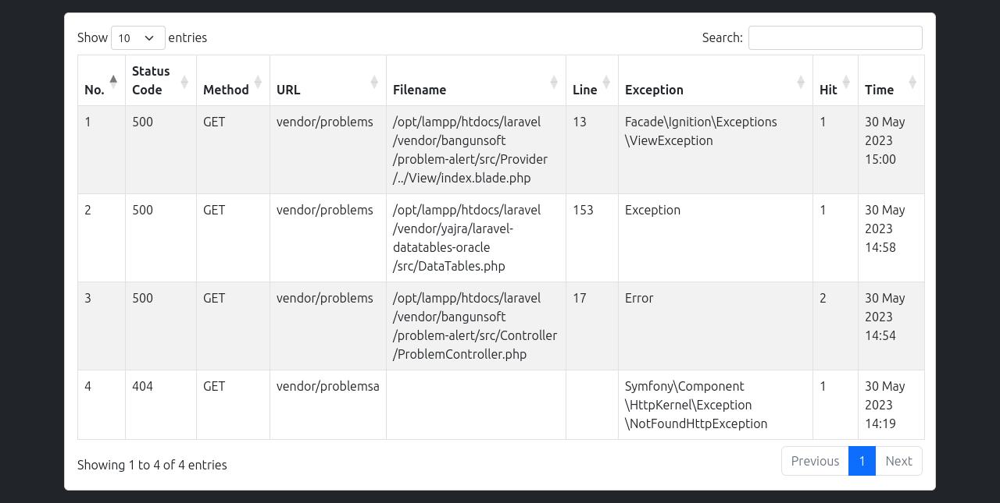

## Problem Alert
Problem Alert is laravel library for handling error and saving this to database.

## Laravel Support
- Laravel 6++

## Installing
You can install this library using composer
```terminal
composer require bangunsoft/problem-alert
php artisan vendor:publish --tag=problem-config
php artisan migrate
```

## View Access
- Login to your website
- Open ```{APP_URL}/vendor/problems``` in your browser. 

## Screenshoot


## Progress
- Catch errors (Done)
- Catch http request if not 2xx (Done)
- MVC (Done)
- I haven't idea

## Testing
Open terminal and run
```terminal
./vendor/bin/phpunit ./vendor/bangunsoft/problem-alert/tests/TestCase.php
```

## Contribute
If you want join to collaborations with me, I'm very happy for that. 
You can contact me via email [Bangunsoft@gmail.com](mailto:bangunsoft@gmail.com)

### Note
My English is bad, so sorry for that.